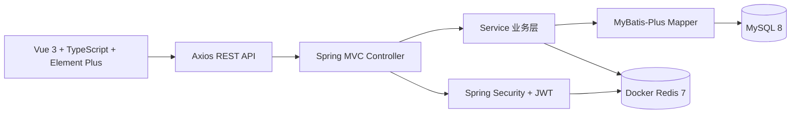
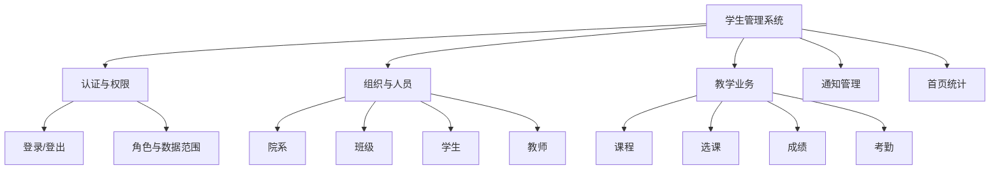
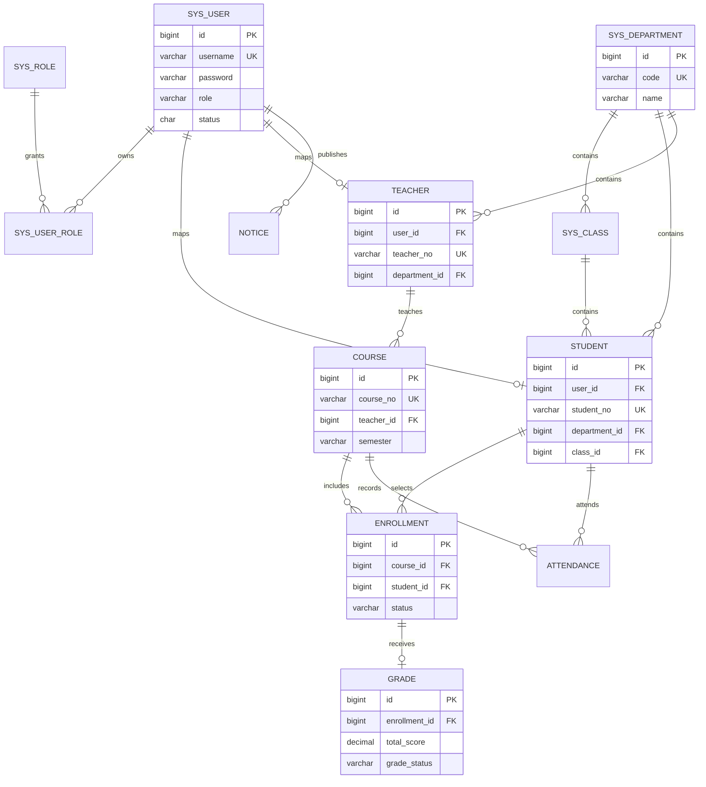

# 课程交付材料

## 系统架构图

## 功能模块图

## 数据库关系图

## 核心业务流程

### 登录流程

1. 前端提交用户名和密码。
2. Spring MVC 接收请求，Service 查询账号并使用 BCrypt 校验密码。
3. JwtService 签发带唯一 `jti` 的 JWT。
4. Redis 保存 `session:{userId}` 与令牌的对应关系。
5. 前端保存令牌，后续请求统一携带 `Authorization` 请求头。
6. 过滤器校验签名、过期时间、Redis 会话、黑名单和账号状态。

### 成绩流程

1. 教师选择本人课程的选课记录。
2. 后端校验教师是否拥有该选课记录对应的课程。
3. 校验三项成绩均在 0 到 100 之间。
4. Service 按 30%、30%、40% 计算总评。
5. Mapper 使用 MyBatis-Plus 管理的 Mapper 层写入成绩。
6. 学生端只能读取本人成绩。

## 论文建议目录

1. 摘要
2. 目录
3. 绪论
4. 系统开发技术
5. 系统需求分析
6. 系统总体设计
7. 系统详细设计与实现
8. 系统测试
9. 结论
10. 致谢
11. 参考文献

论文重点内容：

- 对比前后端分离架构和传统单体页面开发方式。
- 说明 Spring MVC、MyBatis-Plus、MySQL、Redis 和 Vue 3 的选型原因。
- 展示三类角色权限和教师、学生数据范围控制。
- 说明成绩自动计算、JWT 会话和 Redis 黑名单实现。
- 使用测试用例表记录登录、权限、CRUD、成绩、考勤和异常场景。

## 答辩演示流程

1. 展示项目目录、技术栈和启动环境。
2. 使用管理员账号登录，展示首页统计。
3. 演示院系、班级、学生和教师基础数据维护。
4. 演示课程创建与教师授课关系。
5. 切换教师账号，展示本人课程、选课名单、成绩和考勤。
6. 切换学生账号，演示可选课程、选课、成绩和考勤查看。
7. 展示通知发布和角色可见范围。
8. 用浏览器开发者工具展示 REST 请求、JWT 请求头和统一响应结构。
9. 展示测试计划、构建结果和项目总结。

## 截图清单

- 登录页和三类角色首页。
- 管理员院系、学生和课程管理页。
- 教师成绩录入和考勤维护页。
- 学生选课、成绩和通知页。
- 数据库表结构和初始化数据。
- OpenAPI JSON 响应。
- 测试执行结果和项目目录。
