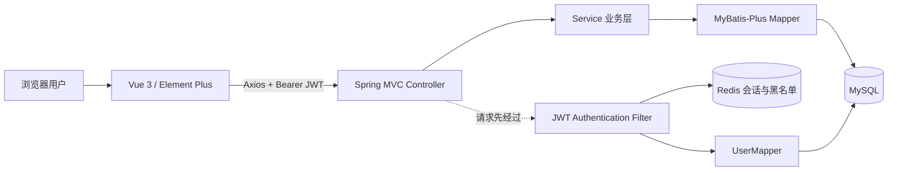
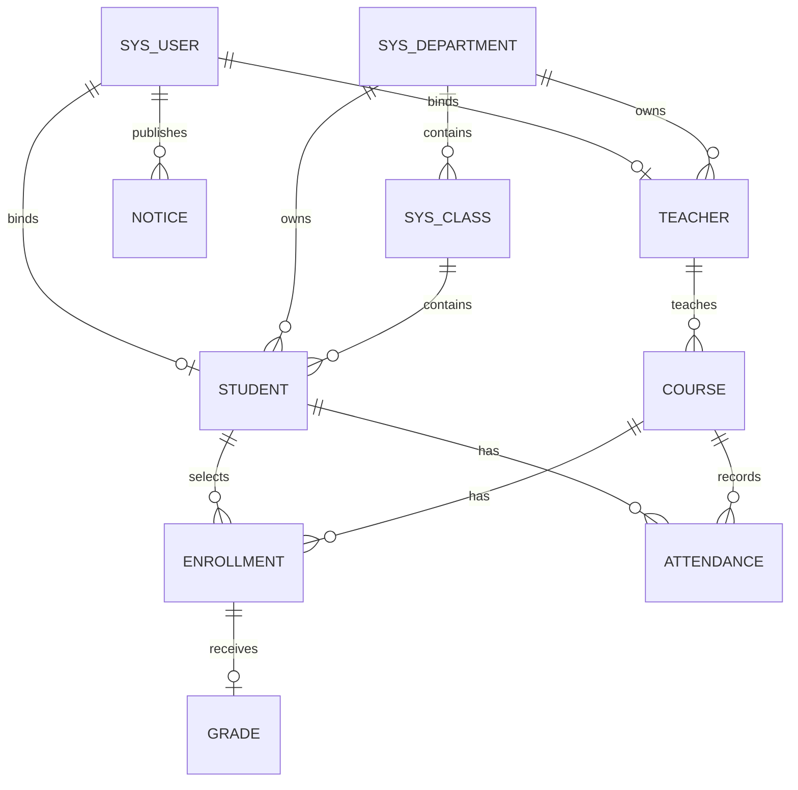
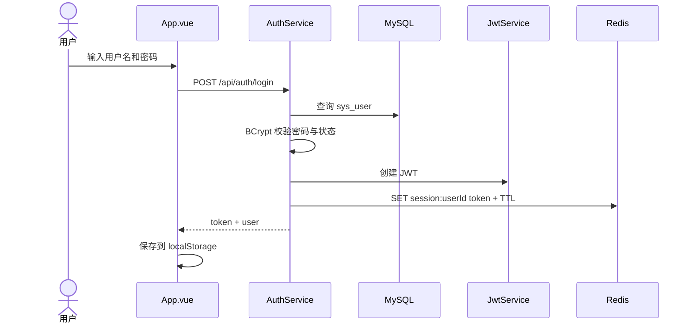

# 学生管理系统项目结构分析

> 本文基于当前仓库源码整理，面向项目交接、课程答辩、维护开发和后续重构。分析粒度覆盖顶层目录、技术架构、后端模块与类、前端组成、数据库实体关系、关键调用流程、权限边界、测试以及当前结构的改进方向。

## 1. 项目概览

该项目是一个前后端分离的学生管理系统，整体采用“Vue 单页应用 + Spring Boot REST API + MySQL + Redis”的单体架构。

- 后端：JDK 21、Spring Boot 3.5.6、Spring MVC、Spring Security、MyBatis-Plus。
- 前端：Vue 3.5、TypeScript、Vite 6、Element Plus、Axios。
- 数据库：MySQL 8，保存用户、组织、教学和通知数据。
- 缓存/会话：Redis 7，保存当前有效 JWT，并维护退出登录后的令牌黑名单。
- 接口协议：JSON REST API，统一响应体为 `ApiResponse<T>`。
- 身份模型：管理员 `ADMIN`、教师 `TEACHER`、学生 `STUDENT`。
- 代码规模：后端主代码 41 个 Java 类，测试代码 4 个 Java 类；前端业务主要集中在一个 Vue 页面中。

系统是单 Maven 模块、单 Spring Boot 应用，并非微服务。所谓“模块”主要通过 Java 包、业务类和前端菜单进行逻辑划分。

## 2. 顶层目录

```text
SpringBoot Vue Mysql/
├─ pom.xml                         Maven 后端工程与依赖配置
├─ README.md                       环境、启动方式和演示账号
├─ database/                       独立数据库初始化及修复脚本
├─ docs/                           API、实施、测试、课程交付与结构文档
├─ frontend/                       Vue 3 前端工程
├─ scripts/                        Windows 启动和接口冒烟测试脚本
├─ src/
│  ├─ main/
│  │  ├─ java/com/student/         Spring Boot 后端源码
│  │  └─ resources/                应用配置和数据库脚本
│  └─ test/java/com/student/       后端单元测试
└─ target/                         Maven 编译产物，不属于源码
```

各目录的职责如下：

| 目录/文件 | 职责 | 说明 |
| --- | --- | --- |
| `@pom.xml:1` | 后端构建入口 | 约束 Java 21、Spring Boot 3.5.6、MyBatis-Plus 3.5.5、JJWT 0.12.6 |
| `@src/main/java` | 后端源码 | 包含启动、配置、安全、通用组件和业务模块 |
| `@src/main/resources` | 后端资源 | `@src/main/resources/application.yml:1` 配置连接、JWT、CORS；`@src/main/resources/db` 保存建表及种子数据 |
| `@src/test/java` | 后端测试 | 使用 JUnit 5 与 Mockito，当前以 Service/JWT 单元测试为主 |
| `@frontend` | 前端源码 | Vite 工程，入口为 `@frontend/src/main.ts:1`，主要页面为 `@frontend/src/App.vue:1` |
| `@database` | 数据库运维脚本 | 提供完整初始化和默认密码修复脚本 |
| `@scripts` | 本地运行辅助 | 设置 JDK、分别启动前后端、同时启动、执行 API 冒烟测试 |
| `@docs` | 项目文档 | 已有 API、实施计划、测试计划、课程交付材料；本文补充源码结构分析 |

## 3. 总体架构



典型请求链路：

1. 前端通过 `api.ts` 创建的 Axios 实例发出 `/api/**` 请求。
2. 请求拦截器从浏览器 `localStorage` 读取 `student_token`，写入 `Authorization: Bearer <token>`。
3. 后端 `JwtAuthenticationFilter` 验证 JWT 签名、Redis 黑名单、当前用户会话以及数据库账号状态。
4. 认证成功后，过滤器把用户 ID 和 `ROLE_ADMIN/ROLE_TEACHER/ROLE_STUDENT` 写入 Spring Security 上下文。
5. Controller 将 HTTP 参数转给 Service。
6. Service 执行业务校验、权限判断和事务控制，再调用 Mapper。
7. Mapper 通过 MyBatis-Plus CRUD 或注解 SQL 访问 MySQL。
8. Controller 使用 `ApiResponse` 返回统一 JSON，前端响应拦截器提取其中的 `data`。

## 4. 后端包结构

```text
com.student
├─ StudentManagementApplication.java      应用启动类
├─ config/
│  ├─ SecurityConfig.java                 Spring Security、CORS、密码编码器
│  └─ MybatisPlusConfig.java              MyBatis-Plus 分页插件
├─ common/
│  ├─ ApiResponse.java                    统一响应模型
│  ├─ PageResult.java                     分页响应模型
│  ├─ BusinessException.java              业务异常
│  ├─ GlobalExceptionHandler.java         全局异常转换
│  └─ MapUtils.java                       Map 字段读取工具
├─ security/
│  ├─ JwtService.java                     JWT 生成与解析
│  └─ JwtAuthenticationFilter.java        请求认证过滤器
├─ auth/
│  ├─ AuthController.java                 登录、退出、个人信息接口
│  └─ AuthService.java                    认证与会话业务
├─ dashboard/
│  ├─ DashboardController.java            首页统计接口
│  └─ DashboardService.java               分角色统计业务
├─ academic/
│  ├─ AcademicController.java             教学域 REST 接口集合
│  └─ AcademicService.java                教学域业务集合
└─ system/
   ├─ user/
   │  ├─ UserController.java              用户和角色接口
   │  └─ UserService.java                 账号管理业务
   ├─ entity/                             11 个数据库实体类
   └─ mapper/                             12 个数据访问接口
```

## 5. 启动与配置模块

### 5.1 `StudentManagementApplication`

源码：`@src/main/java/com/student/StudentManagementApplication.java:9`

项目唯一启动类，包含两个关键注解：

- `@SpringBootApplication`：启用自动配置、组件扫描和 Spring Boot 启动能力。
- `@MapperScan("com.student.system.mapper")`：统一扫描 Mapper 接口。

`main` 方法通过 `SpringApplication.run` 启动内嵌 Web 服务，默认端口为 `8080`。

### 5.2 `SecurityConfig`

源码：`@src/main/java/com/student/config/SecurityConfig.java:30`

该类负责全局 Web 安全策略：

- 关闭 CSRF，适配无状态 REST API。
- 启用 CORS，允许来源由 `app.cors.allowed-origins` 配置。
- 使用 `SessionCreationPolicy.STATELESS`，不创建传统 HTTP Session。
- 放行登录接口、OpenAPI JSON、错误处理路径和所有 OPTIONS 预检请求。
- 其余请求必须认证。
- 在用户名密码过滤器之前注册 `JwtAuthenticationFilter`。
- 未认证返回 HTTP 401，权限不足返回 HTTP 403，并保持统一 JSON 响应格式。
- 提供 BCrypt `PasswordEncoder` Bean。
- 开启方法安全 `@EnableMethodSecurity`；当前业务代码主要通过 Service 内部的角色判断授权，尚未使用 `@PreAuthorize`。

### 5.3 `MybatisPlusConfig`

源码：`@src/main/java/com/student/config/MybatisPlusConfig.java:10`

创建 `MybatisPlusInterceptor`，并注册 MySQL 方言的 `PaginationInnerInterceptor`。目前用户列表通过 MyBatis-Plus `Page` 使用该插件；学生列表则在自定义 SQL 中手工使用 `LIMIT/OFFSET`。

### 5.4 `application.yml`

配置入口：`@src/main/resources/application.yml:1`

主要配置项：

| 配置 | 默认值 | 用途 |
| --- | --- | --- |
| `server.port` | `8080` | 后端 HTTP 端口 |
| `spring.datasource.url` | 本机 `3306/student_management` | MySQL JDBC 地址 |
| `MYSQL_USERNAME` / `MYSQL_PASSWORD` | `root` / `root` | 可用环境变量覆盖数据库凭据 |
| `REDIS_HOST` / `REDIS_PORT` | `localhost` / `6379` | Redis 地址 |
| `spring.sql.init.mode` | `never` | 启动时不自动执行 SQL 脚本 |
| `app.jwt.expiration-ms` | `7200000` | JWT 与 Redis 会话默认有效期 2 小时 |
| `app.jwt.secret` | 开发默认密钥 | JWT HMAC 签名密钥，生产环境必须覆盖 |
| `app.cors.allowed-origins` | `http://localhost:5173` | 允许访问后端的前端源 |
| `springdoc.api-docs.enabled` | `true` | 开启 `/v3/api-docs` |
| `springdoc.swagger-ui.enabled` | `false` | 不提供 Swagger UI |

## 6. 通用基础类

### 6.1 `ApiResponse<T>`

源码：`@src/main/java/com/student/common/ApiResponse.java:3`

Java Record，统一接口响应为：

```json
{
  "code": 0,
  "message": "success",
  "data": {}
}
```

- `ok(data)`：成功且带数据。
- `ok()`：成功但无数据。
- `error(code, message)`：失败，无数据。

注意：`BusinessException` 经全局异常处理后通常仍可能使用 HTTP 200，业务成功与否主要依赖响应体 `code`；安全过滤链产生的未登录和无权限错误则会设置真实 HTTP 401/403。

### 6.2 `PageResult<T>`

源码：`@src/main/java/com/student/common/PageResult.java:5`

分页结果 Record，字段包括：

- `records`：当前页数据。
- `total`：总记录数。
- `current`：当前页码。
- `size`：每页数量。

当前用于用户列表和学生列表。

### 6.3 `BusinessException`

源码：`@src/main/java/com/student/common/BusinessException.java:3`

自定义运行时异常，携带业务 `code`。默认错误码为 400，也可明确传入 401、403、404、409 或 503。

### 6.4 `GlobalExceptionHandler`

源码：`@src/main/java/com/student/common/GlobalExceptionHandler.java:12`

使用 `@RestControllerAdvice` 将异常转换成统一响应：

| 异常 | 返回码 | 典型场景 |
| --- | ---: | --- |
| `BusinessException` | 异常自带 code | 权限不足、记录不存在、业务冲突 |
| `MethodArgumentNotValidException` | 400 | `@Valid` DTO 校验失败 |
| `AccessDeniedException` | 403 | Spring Security 方法访问拒绝 |
| `DataAccessException` | 409 | 唯一键冲突、外键引用等数据库问题 |
| 其他 `Exception` | 500 | 未预期的服务端异常 |

### 6.5 `MapUtils`

源码：`@src/main/java/com/student/common/MapUtils.java:1`

提供 `string(map, key)` 和 `id(map)` 两个静态方法，用于从动态 Map 中转换字符串与 ID。当前主业务类中多数参数转换仍使用 `AcademicService` 自己的辅助方法，因此该工具的实际使用范围较小。

## 7. 安全与认证模块

### 7.1 `JwtService`

源码：`@src/main/java/com/student/security/JwtService.java:15`

职责单一，负责 JWT：

- `createToken(userId, username, role)`：创建带唯一 `jti`、用户 ID、用户名、角色、签发时间和过期时间的令牌。
- `parse(token)`：验证签名并解析 Claims。
- `expirationMs()`：暴露有效期，供 Redis 会话 TTL 使用。

JWT 的 `subject` 是用户 ID；`username` 和 `role` 放在自定义 Claim 中。实际请求认证时仍会回查数据库，避免只信任令牌中的旧角色或旧状态。

### 7.2 `JwtAuthenticationFilter`

源码：`@src/main/java/com/student/security/JwtAuthenticationFilter.java:23`

继承 `OncePerRequestFilter`，每个请求最多执行一次。认证条件依次为：

1. 请求含有 Bearer Token。
2. JWT 可以通过签名和有效期校验。
3. Redis 不存在 `jwt:blacklist:<token>`。
4. Redis 中 `session:<userId>` 的值与当前 Token 完全一致。
5. 数据库用户存在且 `status=1`。
6. 数据库角色是三种合法角色之一。

满足条件后，以用户 ID 作为 `Authentication.name`，授予一个 `ROLE_<角色>` 权限。

这种设计意味着一个用户同一时间只保留一个有效登录 Token：新登录写入同一个 `session:<userId>`，旧 Token 即使尚未过期也会因与 Redis 中当前 Token 不一致而失效。

Redis 不可用时，过滤器直接返回 HTTP 503；无效或过期 Token 则不建立认证，最终由安全配置返回 401。

### 7.3 `AuthController`

源码：`@src/main/java/com/student/auth/AuthController.java:18`

根路径为 `/api/auth`：

| 方法 | 路径 | Service 方法 | 权限 |
| --- | --- | --- | --- |
| POST | `/login` | `login` | 公开 |
| POST | `/logout` | `logout` | 已认证 |
| GET | `/me` | `me` | 已认证 |
| PUT | `/profile` | `updateProfile` | 已认证 |

### 7.4 `AuthService`

源码：`@src/main/java/com/student/auth/AuthService.java:19`

核心方法：

- `login(LoginRequest)`：去除用户名首尾空格，查询用户，校验 BCrypt 密码与账号状态，创建 JWT，将会话写入 Redis，并返回 Token 和简化用户信息。`@src/main/java/com/student/auth/AuthService.java:34`
- `logout(header)`：删除匹配的当前会话，并将 Token 放入黑名单直到其原始过期时间。`@src/main/java/com/student/auth/AuthService.java:59`
- `me(authentication)`：按认证用户 ID 查询个人资料。`@src/main/java/com/student/auth/AuthService.java:81`
- `updateProfile(body, authentication)`：当前只允许修改 `realName`。`@src/main/java/com/student/auth/AuthService.java:86`
- `LoginRequest`：内部 Record DTO，对用户名和密码使用 `@NotBlank` 校验。`@src/main/java/com/student/auth/AuthService.java:32`

## 8. 用户与角色模块

### 8.1 `UserController`

源码：`@src/main/java/com/student/system/user/UserController.java:18`

提供角色说明与登录账号 CRUD：

| 方法 | 路径 | 说明 |
| --- | --- | --- |
| GET | `/api/roles` | 查询三种固定角色说明 |
| GET | `/api/users` | 按用户名/姓名分页搜索账号 |
| POST | `/api/users` | 创建账号 |
| PUT | `/api/users/{id}` | 更新账号、密码、角色或状态 |
| DELETE | `/api/users/{id}` | 删除账号 |

所有接口均要求管理员角色。Controller 使用 `UserRequest` 和 `@Valid` 做基础字段校验。

### 8.2 `UserService`

源码：`@src/main/java/com/student/system/user/UserService.java:19`

主要业务规则：

- 角色集合固定为 `ADMIN`、`TEACHER`、`STUDENT`。
- 用户列表页码最小为 1，每页范围为 1～100。
- 新用户默认密码为 `123456`，入库前通过 BCrypt 编码。
- 未显式传入状态时默认启用；除字符串 `0` 外均归一化为 `1`。
- 用户名必须唯一。
- 已关联教师或学生档案的账号不能直接变更角色。
- 当前登录管理员不能修改自己的角色或状态，也不能删除自己。
- 仍关联教师/学生档案的账号不能删除。

`UserRequest` 字段：`username`、`realName`、`role`、`password`、`status`。前三项必填，密码在更新时留空代表保持原密码。

方法定位：角色列表 `@src/main/java/com/student/system/user/UserService.java:41`，分页查询 `@src/main/java/com/student/system/user/UserService.java:46`，创建 `@src/main/java/com/student/system/user/UserService.java:69`，更新 `@src/main/java/com/student/system/user/UserService.java:86`，删除 `@src/main/java/com/student/system/user/UserService.java:112`。

## 9. 首页仪表盘模块

### 9.1 `DashboardController`

源码：`@src/main/java/com/student/dashboard/DashboardController.java:11`

只提供 `GET /api/dashboard/summary`，将当前认证信息传给 `DashboardService`。

### 9.2 `DashboardService`

源码：`@src/main/java/com/student/dashboard/DashboardService.java:12`

根据角色返回不同统计口径：

统计方法入口：`@src/main/java/com/student/dashboard/DashboardService.java:19`

| 角色 | 统计内容 |
| --- | --- |
| 管理员 | 学生数、教师数、课程数、院系数 |
| 教师 | 本人课程数、所教学生去重数、已录成绩数、考勤记录数 |
| 学生 | 本人课程数、成绩数、考勤记录数、可见通知数 |

所有角色还会获得最多 5 条当前角色可见的最近通知。学生账号如果没有绑定学生档案，会返回 404。

## 10. 教学业务模块

教学业务是当前项目最大的模块，覆盖院系、班级、学生、教师、课程、选课、成绩、考勤与通知九个子域。

### 10.1 `AcademicController`

源码：`@src/main/java/com/student/academic/AcademicController.java:19`

该 Controller 以 `/api` 为根路径，集中暴露 31 个接口。除查询参数和路径参数外，多数写接口直接接收 `Map<String, Object>`，字段级规则由 Service 手工校验。加上认证模块 4 个接口、用户模块 5 个接口和仪表盘模块 1 个接口，后端当前共提供 41 个 REST 接口。

### 10.2 `AcademicService`

源码：`@src/main/java/com/student/academic/AcademicService.java:32`

该类是教学域的核心业务编排层，注入：

- `StudentSystemMapper`：所有关联查询、统计和 Upsert。
- `DepartmentMapper`、`ClassMapper`、`StudentMapper`、`TeacherMapper`、`CourseMapper`：单表 CRUD。
- `UserMapper`：教师账号联动。
- `PasswordEncoder`：教师账号密码编码。

按子域划分的方法和规则如下。

#### 院系

- `departments`：管理员查询院系列表。`@src/main/java/com/student/academic/AcademicService.java:55`
- `createDepartment`：创建院系，名称和编码必填。`@src/main/java/com/student/academic/AcademicService.java:61`
- `updateDepartment`：先确认院系存在，再整体更新主要字段。`@src/main/java/com/student/academic/AcademicService.java:71`
- `deleteDepartment`：直接删除；如果仍被班级、教师或学生引用，由数据库外键阻止并转换为冲突错误。`@src/main/java/com/student/academic/AcademicService.java:84`

#### 班级

- `classes`：管理员查询班级及所属院系名称。`@src/main/java/com/student/academic/AcademicService.java:89`
- `createClass`：名称、编码、院系 ID、年级必填。`@src/main/java/com/student/academic/AcademicService.java:95`
- `updateClass`：校验存在后更新。`@src/main/java/com/student/academic/AcademicService.java:106`
- `deleteClass`：删除班级，学生引用由数据库外键保护。`@src/main/java/com/student/academic/AcademicService.java:120`

#### 学生

- `students`：管理员分页查询，可按学号、姓名或手机号模糊搜索。`@src/main/java/com/student/academic/AcademicService.java:125`
- `createStudent`：创建学生档案；学号和姓名必填，账号、院系、班级、入学年份等可选。`@src/main/java/com/student/academic/AcademicService.java:135`
- `updateStudent`：局部更新，仅修改请求体中出现的字段。`@src/main/java/com/student/academic/AcademicService.java:151`
- `deleteStudent`：删除档案，存在选课/考勤等引用时由外键阻止。`@src/main/java/com/student/academic/AcademicService.java:170`

当前“创建学生档案”不会同步创建登录账号；只有数据库种子数据中的示例学生显式绑定了 `sys_user`。如果业务要求所有学生可登录，需要增加创建/绑定学生账号的流程。

#### 教师

- `teachers`：管理员查询教师档案、院系和登录账号状态。`@src/main/java/com/student/academic/AcademicService.java:175`
- `createTeacher`：在一个事务内先创建 `TEACHER` 用户账号，再创建教师档案并绑定 `user_id`。`@src/main/java/com/student/academic/AcademicService.java:181`
- `updateTeacher`：更新教师档案，同时可同步真实姓名、账号状态和密码。`@src/main/java/com/student/academic/AcademicService.java:211`
- `deleteTeacher`：如果仍负责课程则拒绝；否则在一个事务中删除教师档案和绑定账号。`@src/main/java/com/student/academic/AcademicService.java:243`

#### 课程

- `courses`：管理员看全部课程；教师只看本人授课课程；学生只看本人已选课程。`@src/main/java/com/student/academic/AcademicService.java:259`
- `availableCourses`：学生查看尚未选择的课程。`@src/main/java/com/student/academic/AcademicService.java:266`
- `createCourse`：管理员创建课程，默认学分 2.0、学时 32。`@src/main/java/com/student/academic/AcademicService.java:272`
- `updateCourse`：管理员局部更新课程。`@src/main/java/com/student/academic/AcademicService.java:286`
- `deleteCourse`：管理员删除课程，选课引用由数据库外键保护。`@src/main/java/com/student/academic/AcademicService.java:303`

#### 选课

- `enrollments(courseId)`：管理员看全部，教师看本人课程名单，学生看本人选课；可附加课程 ID 过滤。`@src/main/java/com/student/academic/AcademicService.java:311`
- `createEnrollment`：管理员可为指定学生选课；学生只能为自己的学生档案选课。`@src/main/java/com/student/academic/AcademicService.java:318`
- `deleteEnrollment`：管理员可删除任意记录；学生只能退选自己的记录；教师无权退选。`@src/main/java/com/student/academic/AcademicService.java:326`
- 数据库唯一键 `(course_id, student_id)` 防止重复选课。

#### 成绩

- `grades`：按角色限制查询范围。`@src/main/java/com/student/academic/AcademicService.java:337`
- `saveGrade(enrollmentId, body)`：管理员可维护全部成绩；教师只能维护本人课程的成绩。`@src/main/java/com/student/academic/AcademicService.java:344`
- 三项成绩必须在 0～100 之间。
- 总评公式：`平时 × 30% + 期中 × 30% + 期末 × 40%`，保留两位小数并四舍五入。
- 总评不低于 60 为“合格”，否则为“不合格”。
- 使用 MySQL `ON DUPLICATE KEY UPDATE`，同一选课记录的成绩执行新增或覆盖更新。

#### 考勤

- `attendance`：管理员看全部；教师看本人课程；学生看本人记录。`@src/main/java/com/student/academic/AcademicService.java:362`
- `saveAttendance`：管理员可维护全部；教师只能维护本人课程。`@src/main/java/com/student/academic/AcademicService.java:369`
- 唯一键 `(course_id, student_id, attendance_date)` 保证同一课程、学生和日期只有一条考勤。
- 保存时使用 Upsert，重复记录会更新状态和备注。

#### 通知

- `notices`：只返回 `ALL` 或当前角色可见的通知。`@src/main/java/com/student/academic/AcademicService.java:376`
- `createNotice`：管理员或教师可发布通知。`@src/main/java/com/student/academic/AcademicService.java:381`
- `deleteNotice`：仅管理员可删除。`@src/main/java/com/student/academic/AcademicService.java:388`
- 通知记录保存发布者用户 ID、目标角色、发布时间和状态。

### 10.3 权限矩阵

| 功能 | 管理员 | 教师 | 学生 |
| --- | --- | --- | --- |
| 首页统计 | 全局统计 | 本人教学统计 | 本人学习统计 |
| 用户、角色 | 增删改查 | 无权访问 | 无权访问 |
| 院系、班级 | 增删改查 | 无权访问 | 无权访问 |
| 学生、教师 | 增删改查 | 无权访问 | 无权访问 |
| 课程查询 | 全部 | 本人课程 | 已选课程 |
| 课程维护 | 可以 | 不可以 | 不可以 |
| 选课查询 | 全部 | 本人课程名单 | 本人选课 |
| 新增选课 | 为任意学生 | 不可以 | 仅自己 |
| 删除选课 | 任意 | 不可以 | 仅自己 |
| 成绩查询 | 全部 | 本人课程 | 本人成绩 |
| 成绩录入 | 任意 | 仅本人课程 | 不可以 |
| 考勤查询 | 全部 | 本人课程 | 本人考勤 |
| 考勤登记 | 任意 | 仅本人课程 | 不可以 |
| 通知查询 | 按角色可见 | 按角色可见 | 按角色可见 |
| 通知发布 | 可以 | 可以 | 不可以 |
| 通知删除 | 可以 | 不可以 | 不可以 |

## 11. 实体类

所有实体使用 Lombok `@Data` 生成访问器，并通过 MyBatis-Plus `@TableName`、`@TableId` 映射数据库。

| 实体类 | 表 | 核心字段 | 业务含义 |
| --- | --- | --- | --- |
| `@src/main/java/com/student/system/entity/UserEntity.java:12` | `sys_user` | id、username、password、realName、role、status、createdAt | 登录账号与系统角色 |
| `@src/main/java/com/student/system/entity/DepartmentEntity.java:12` | `sys_department` | id、name、code、description、createdAt | 院系基础资料 |
| `@src/main/java/com/student/system/entity/ClassEntity.java:12` | `sys_class` | id、name、code、departmentId、gradeYear、createdAt | 行政班级 |
| `@src/main/java/com/student/system/entity/TeacherEntity.java:10` | `teacher` | id、userId、teacherNo、name、title、departmentId、phone | 教师业务档案 |
| `@src/main/java/com/student/system/entity/StudentEntity.java:10` | `student` | id、userId、studentNo、name、gender、phone、email、departmentId、classId、admissionYear、status | 学生业务档案 |
| `@src/main/java/com/student/system/entity/CourseEntity.java:12` | `course` | id、courseNo、name、credit、hours、semester、teacherId、description | 开设课程与授课教师 |
| `@src/main/java/com/student/system/entity/EnrollmentEntity.java:12` | `enrollment` | id、courseId、studentId、enrolledAt、status | 学生与课程的多对多关系 |
| `@src/main/java/com/student/system/entity/GradeEntity.java:13` | `grade` | id、enrollmentId、usualScore、midtermScore、finalScore、totalScore、gradeStatus、updatedAt | 某次选课对应的唯一成绩 |
| `@src/main/java/com/student/system/entity/AttendanceEntity.java:12` | `attendance` | id、courseId、studentId、attendanceDate、status、remark | 按课程、学生、日期记录考勤 |
| `@src/main/java/com/student/system/entity/NoticeEntity.java:12` | `notice` | id、title、content、publisherId、targetRole、publishedAt、status | 面向角色发布的通知 |
| `@src/main/java/com/student/system/entity/OperationLogEntity.java:12` | `operation_log` | id、userId、action、method、path、ip、createdAt | 操作审计预留模型 |

`OperationLogEntity` 和对应 Mapper 已定义，但当前没有过滤器、切面或 Service 写入操作日志，因此 `operation_log` 表尚未真正接入业务流程。对应数据访问入口为 `@src/main/java/com/student/system/mapper/OperationLogMapper.java:8`。

## 12. Mapper 数据访问层

### 12.1 单表 Mapper

以下接口都继承 `BaseMapper<实体>`，直接获得 `selectById`、`insert`、`updateById`、`deleteById` 等通用 CRUD：

- `@src/main/java/com/student/system/mapper/UserMapper.java:11`
- `@src/main/java/com/student/system/mapper/DepartmentMapper.java:8`
- `@src/main/java/com/student/system/mapper/ClassMapper.java:8`
- `@src/main/java/com/student/system/mapper/StudentMapper.java:8`
- `@src/main/java/com/student/system/mapper/TeacherMapper.java:8`
- `@src/main/java/com/student/system/mapper/CourseMapper.java:8`
- `@src/main/java/com/student/system/mapper/EnrollmentMapper.java:8`
- `@src/main/java/com/student/system/mapper/GradeMapper.java:8`
- `@src/main/java/com/student/system/mapper/AttendanceMapper.java:8`
- `@src/main/java/com/student/system/mapper/NoticeMapper.java:8`
- `@src/main/java/com/student/system/mapper/OperationLogMapper.java:8`

其中院系、班级、学生、教师、课程和用户 Mapper 已被 Service 直接使用。`EnrollmentMapper`、`GradeMapper`、`AttendanceMapper`、`NoticeMapper`、`OperationLogMapper` 当前没有被业务类注入，相关操作主要集中在 `StudentSystemMapper`。

### 12.2 `UserMapper`

源码：`@src/main/java/com/student/system/mapper/UserMapper.java:11`

除通用 CRUD 外，提供：

- `findLoginUser`：按用户名读取认证所需字段，包括密码。
- `findProfile`：读取当前用户可展示资料。
- `findAuthenticationUser`：过滤器每次认证时回查角色与状态。
- `countTeacherReference` / `countStudentReference`：删除账号或修改角色前检查档案引用。

### 12.3 `StudentSystemMapper`

源码：`@src/main/java/com/student/system/mapper/StudentSystemMapper.java:11`

这是项目的综合查询与命令 Mapper，共承担以下职责：

- 院系、班级、学生、教师的关联列表查询。
- 课程按教师/学生范围过滤。
- 查询学生可选课程。
- 选课列表、插入和受限删除。
- 成绩列表、教师所有权检查和成绩 Upsert。
- 考勤列表、课程所有权检查和考勤 Upsert。
- 通知查询、发布、删除。
- 学生档案 ID 解析。
- 三类角色的首页统计和最近通知查询。

SQL 全部写在 Mapper 注解中，没有 XML Mapper 文件。配置中的 `mapper-locations: classpath:/mapper/*.xml` 目前是预留项。

数据库建表语句集中在 `@src/main/resources/db/schema.sql:8`，演示数据集中在 `@src/main/resources/db/data.sql:3`。

## 13. 数据库结构与关系



### 13.1 表的分组

- 身份：`sys_user`。
- 组织：`sys_department`、`sys_class`。
- 人员：`teacher`、`student`。
- 教学：`course`、`enrollment`、`grade`、`attendance`。
- 内容与审计：`notice`、`operation_log`。

### 13.2 关键约束

- 用户名、院系名称/编码、班级编码、工号、学号、课程编号均唯一。
- 教师和学生的 `user_id` 均唯一，因此一个账号最多绑定一个同类档案。
- 选课的课程与学生组合唯一。
- 一条选课最多有一条成绩。
- 同一课程、学生、日期只有一条考勤。
- 多数业务关系由外键保护，未配置级联删除；删除被引用主记录时会失败。

### 13.3 初始化数据

种子脚本提供：

- 2 个院系、3 个班级。
- 1 个管理员账号、1 个教师账号、1 个学生账号。
- 1 名绑定账号的教师、3 名学生（其中 1 名绑定账号）。
- 3 门课程、5 条选课、2 条成绩、4 条考勤、2 条通知。
- 三个演示账号密码均为 `123456`。

## 14. 前端结构

```text
frontend/
├─ package.json                依赖与 dev/build/preview 命令
├─ vite.config.ts              Vite 插件、端口和后端代理
├─ tsconfig.json               TypeScript 配置
├─ index.html                  HTML 宿主页
└─ src/
   ├─ main.ts                  Vue 应用入口
   ├─ api.ts                   Axios 实例与认证拦截器
   ├─ App.vue                  登录页、布局、菜单、表格和所有业务弹窗
   ├─ styles.css               全局页面样式
   └─ env.d.ts                 Vite 类型声明
```

### 14.1 `main.ts`

源码：`@frontend/src/main.ts:1`

创建 Vue 应用，安装 Pinia 和 Element Plus，并挂载根组件 `App.vue`。当前虽然注册了 Pinia，但没有定义 Store；状态仍集中在 `App.vue` 内。

### 14.2 `api.ts`

源码：`@frontend/src/api.ts:1`

封装 Axios：

- 基础地址来自 `VITE_API_BASE_URL`，未配置时使用相对地址。
- 本地开发由 Vite 把 `/api` 代理到 `http://localhost:8080`。
- 请求超时为 10 秒。
- 请求前自动附加本地 Token。
- 响应体 `code=0` 时返回 `data`，其他业务码转换为 rejected Promise。
- 遇到业务码或 HTTP 状态 401 时清理本地认证并刷新页面。

### 14.3 `App.vue`

源码入口：`@frontend/src/App.vue:1`

页面模板：`@frontend/src/App.vue:328`

这是当前前端的核心，也是唯一业务页面组件，包含以下内容：

- 登录状态、用户信息和 Token。
- 按角色动态计算的侧边菜单。
- 工作台统计卡片与最近通知。
- 所有模块共用的数据表格和分页。
- 用户、学生、教师、院系、班级、课程、选课、成绩、考勤、通知的表单弹窗。
- 个人资料弹窗。
- 所有接口加载、创建、更新、删除逻辑。
- Element Plus 表单校验、消息和删除确认。

关键响应式状态：

| 状态 | 用途 |
| --- | --- |
| `token` / `user` | 当前登录状态 |
| `activeMenu` | 当前功能模块 |
| `rows` / `total` / `page` / `pageSize` | 通用列表与分页 |
| `stats` / `notices` | 首页数据 |
| `dialogVisible` / `dialogType` / `form` | 通用业务弹窗 |
| `reference` | 院系、班级、教师、课程、学生、选课等表单基础数据 |

关键计算属性：

- `menus`：根据角色生成菜单。
- `columns`：根据当前模块生成表格列。
- `rules`：集中定义通用表单规则。
- `canCreate`、`canEditRows`、`canDeleteRows`：控制界面按钮可见性。
- `attendanceStudents`：按所选课程过滤可登记考勤的学生。
- `enrollmentCourses`：学生使用可选课程，管理员使用全部课程。

这些计算属性可分别定位到：`@frontend/src/App.vue:57`、`@frontend/src/App.vue:75`、`@frontend/src/App.vue:92`、`@frontend/src/App.vue:132`、`@frontend/src/App.vue:118`、`@frontend/src/App.vue:130`。

关键方法：

- `login` / `logout`：维护服务端会话和本地认证状态。
- `loadDashboard`：加载角色首页统计。
- `loadReferences`：并行加载表单所需基础数据。
- `loadRows`：根据当前菜单自动访问 `/api/<菜单名>`。
- `openCreate` / `openEdit`：准备通用弹窗数据。
- `submitForm`：按模块选择 POST 或 PUT；成绩与考勤使用特殊保存路径。
- `removeRow`：二次确认后删除或退选。
- `saveProfile`：更新真实姓名并同步本地用户信息。

主要请求方法从 `@frontend/src/App.vue:147` 开始，通用加载逻辑位于 `@frontend/src/App.vue:181` 和 `@frontend/src/App.vue:211`，统一保存逻辑位于 `@frontend/src/App.vue:259`。

前端依赖中包含 Vue Router，但当前没有创建路由实例；功能切换完全由 `activeMenu` 控制，因此刷新页面后会回到工作台，也无法通过 URL 直接定位具体模块。

## 15. 关键业务流程

### 15.1 登录流程



### 15.2 教师创建流程

管理员提交教师信息后，`AcademicService.createTeacher` 在同一事务中：

1. 校验管理员身份、用户名唯一、名称和工号非空。
2. 创建角色固定为 `TEACHER` 的 `sys_user` 账号。
3. 使用新账号 ID 创建 `teacher` 档案。
4. 任一步骤失败时整体回滚，避免孤立账号或孤立教师档案。

### 15.3 学生选课流程

1. 学生查询 `/api/courses/available`，数据库排除已经选过的课程。
2. 前端提交课程 ID 到 `/api/enrollments`。
3. Service 从认证用户 ID 解析绑定的学生档案 ID，不接受学生冒充其他学生。
4. Mapper 插入选课记录，数据库唯一键阻止重复选课。

### 15.4 成绩录入流程

1. 管理员可直接维护；教师先验证选课是否属于本人课程。
2. 校验平时、期中、期末成绩都在 0～100。
3. 计算总评并判断合格状态。
4. 按 `enrollment_id` Upsert 成绩。
5. 学生只能查询自己绑定档案下的成绩。

### 15.5 考勤登记流程

1. 管理员可直接登记；教师先验证课程所有权。
2. 前端从课程选课名单中选择学生。
3. 以课程、学生、日期作为业务唯一键写入。
4. 同日重复提交更新原状态和备注。

## 16. 测试结构

当前测试均为后端快速单元测试，不依赖真实 MySQL 或 Redis：

| 测试类 | 覆盖内容 |
| --- | --- |
| `@src/test/java/com/student/security/JwtServiceTest.java:10` | JWT 创建、Claims、唯一 ID、错误密钥拒绝 |
| `@src/test/java/com/student/auth/AuthServiceTest.java:29` | 登录写入 Redis、禁用账号、个人姓名校验与更新 |
| `@src/test/java/com/student/system/user/UserServiceTest.java:23` | 默认密码、状态归一化、关联账号角色保护、自删除保护 |
| `@src/test/java/com/student/academic/AcademicServiceTest.java:32` | 成绩权重、教师越权保护、学生局部更新 |

`@scripts/api-smoke-test.ps1:1` 是运行态冒烟测试，需要已启动的后端、MySQL 和 Redis。它检查：

- 未登录访问被拒绝。
- 三种演示账号都能登录。
- 管理员可以查询院系。
- 教师不能查询用户管理接口。
- 三种角色的课程数据范围合理。
- 学生可查询自己的成绩和考勤。

当前缺少的测试类型主要包括 Controller 集成测试、真实数据库 Mapper 测试、前端组件测试和端到端浏览器测试。

## 17. 构建与运行

### 17.1 后端

前置条件为 JDK 21、Maven 3.9+、MySQL 8 和 Redis 7。数据库不会随应用启动自动初始化，需要先手工执行建表与种子数据脚本。

Maven 的默认产物坐标为：

```text
com.student:student-management:1.0.0
```

### 17.2 前端

前置条件为 Node.js 20+。开发服务器运行在 5173 端口，并把 `/api` 代理到 8080 端口。生产构建先执行 `vue-tsc --noEmit` 类型检查，再由 Vite 打包。

### 17.3 辅助脚本

- `@scripts/set-java21.bat:1`：验证 `JDK21` 环境变量，设置当前与后续用户会话的 `JAVA_HOME`。
- `@scripts/start-backend.bat:1`：检查 Java、Maven和 `@pom.xml:1` 后启动后端。
- `@scripts/start-frontend.bat:1`：检查 npm 和 `node_modules` 后启动前端。
- `@scripts/start-all.bat:1`：分别打开前后端命令窗口。
- `@scripts/api-smoke-test.ps1:1`：调用运行中的 API 完成基本验收。

## 18. 当前结构的优点

- 前后端职责清楚，接口统一以 JSON 通信。
- 认证链路完整，JWT、Redis 当前会话、黑名单和数据库账号状态形成多层校验。
- 教师和学生的数据范围在查询 SQL 与写操作校验中都有体现。
- 教师账号与档案创建使用事务，成绩和考勤使用幂等 Upsert。
- 数据库具有较完整的唯一键和外键约束。
- Controller 基本只做请求适配，核心业务集中在 Service。
- 已具备单元测试、冒烟测试、API 文档和课程交付文档。
- 用户列表使用 MyBatis-Plus 标准分页，并限制最大页大小，避免无限制查询。

## 19. 当前结构的主要问题与建议

### 19.1 `AcademicService` 职责过多

该类同时承担九个业务子域，修改任一业务都可能影响同一大类，测试和协作成本会随功能增长快速上升。建议按领域拆为：

- `DepartmentService`
- `ClassService`
- `StudentService`
- `TeacherService`
- `CourseService`
- `EnrollmentService`
- `GradeService`
- `AttendanceService`
- `NoticeService`

`AcademicController` 也可对应拆分为多个资源 Controller。

### 19.2 动态 Map 过多

教学接口大量使用 `Map<String, Object>` 作为请求和返回模型，会带来：

- 编译期无法检查字段名与类型。
- 参数错误可能在数字或日期转换时变成 500。
- OpenAPI 难以生成准确 Schema。
- 重构字段时 IDE 无法安全追踪。

建议为每个写操作建立 Request DTO，并使用 Jakarta Validation；关联查询建立 View/Response DTO。

### 19.3 `StudentSystemMapper` 过于集中

综合 Mapper 同时包含查询、写入、权限检查和统计 SQL。建议把 SQL 移回各领域 Mapper，例如 `CourseQueryMapper`、`EnrollmentMapper`、`GradeMapper` 等，并明确哪些是单表仓储、哪些是跨表查询。

### 19.4 前端单文件规模偏大

`App.vue` 同时包含认证、布局、菜单、十余种表格与表单。建议拆分为：

```text
src/
├─ api/                 按领域拆分请求函数
├─ stores/              auth、reference 等 Pinia Store
├─ router/              路由和角色守卫
├─ layouts/             主布局、侧边栏、顶栏
├─ views/               Dashboard、Students、Courses 等页面
├─ components/          通用表格、编辑弹窗
├─ types/               User、Student、Course 等类型
└─ utils/               展示格式化与错误处理
```

这样可以真正使用已经安装的 Pinia 和 Vue Router，并减少 `any`、通用动态表单带来的运行时错误。

### 19.5 学生账号生命周期不完整

教师创建会同步创建账号，学生创建却只创建档案。这会导致部分学生无法登录，也缺少从用户管理界面稳定绑定现有学生档案的流程。建议统一“账号 + 档案”的创建、绑定、禁用和删除策略。

### 19.6 操作日志尚未接入

虽然有 `operation_log` 表、实体和 Mapper，但没有实际写入。可使用 Spring AOP 或过滤器记录管理员/教师的关键写操作，并注意过滤密码、Token 等敏感数据。

### 19.7 错误语义可进一步统一

建议让 `BusinessException` 映射到对应 HTTP 状态，避免部分失败返回 HTTP 200、部分失败返回 HTTP 4xx/5xx。前端仍可保留业务 `code`，但 HTTP 状态应表达传输层结果。

### 19.8 生产安全配置

- 必须使用环境变量覆盖默认 JWT 密钥和数据库密码。
- 应评估把 Token 放在 `localStorage` 的 XSS 风险；生产系统可考虑短期访问令牌配合 HttpOnly Refresh Cookie。
- 可增加登录失败限流、密码复杂度、密码修改、令牌刷新和审计。
- 通知的 `targetRole`、考勤状态、学生状态等目前主要是字符串，应增加枚举和服务端白名单校验。

## 20. 推荐的后续演进顺序

1. 先补齐 DTO、统一参数校验和 HTTP 错误状态，不改变数据库结构。
2. 将 `AcademicService` 和 `StudentSystemMapper` 按领域拆分，并为拆分结果补单元测试。
3. 拆分 `App.vue`，引入类型模型、Vue Router 和 Pinia Store。
4. 统一教师/学生账号与档案生命周期。
5. 接入操作日志、登录安全策略与更完整的集成测试。
6. 数据量增长后，为课程、选课、成绩、考勤和通知列表补分页与必要索引。

## 21. 重要源码索引

- 应用入口：`@src/main/java/com/student/StudentManagementApplication.java:9`
- 安全配置：`@src/main/java/com/student/config/SecurityConfig.java:30`
- JWT 过滤器：`@src/main/java/com/student/security/JwtAuthenticationFilter.java:23`
- 认证业务：`@src/main/java/com/student/auth/AuthService.java:19`
- 用户业务：`@src/main/java/com/student/system/user/UserService.java:19`
- 教学业务：`@src/main/java/com/student/academic/AcademicService.java:32`
- 综合数据访问：`@src/main/java/com/student/system/mapper/StudentSystemMapper.java:11`
- 数据库结构：`@src/main/resources/db/schema.sql:8`
- 数据库演示数据：`@src/main/resources/db/data.sql:3`
- 前端主页面：`@frontend/src/App.vue:1`
- 前端请求封装：`@frontend/src/api.ts:1`
- 接口说明：`@docs/API.md:1`
- 测试计划：`@docs/TEST_PLAN.md:1`
